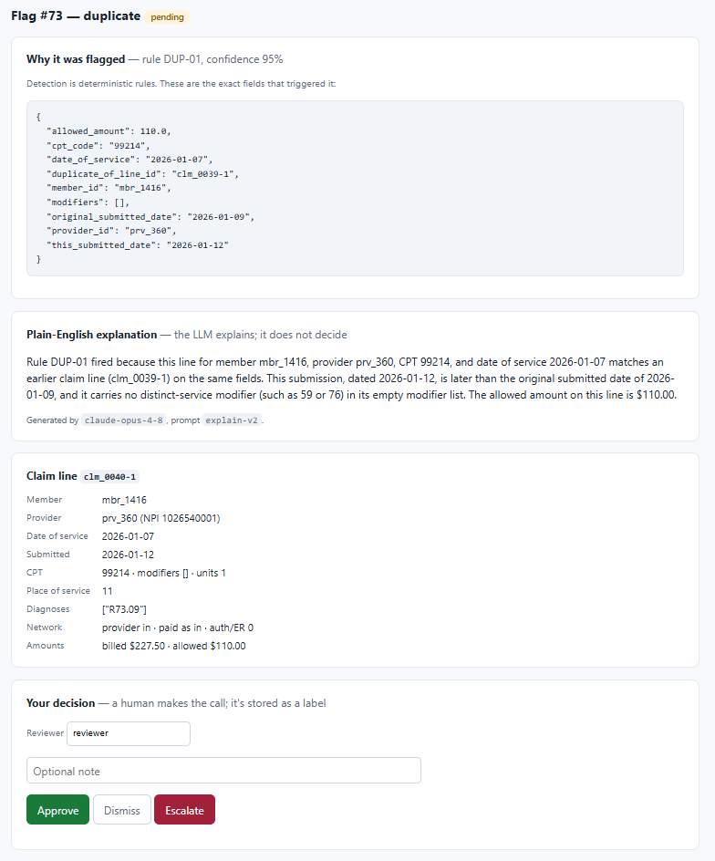
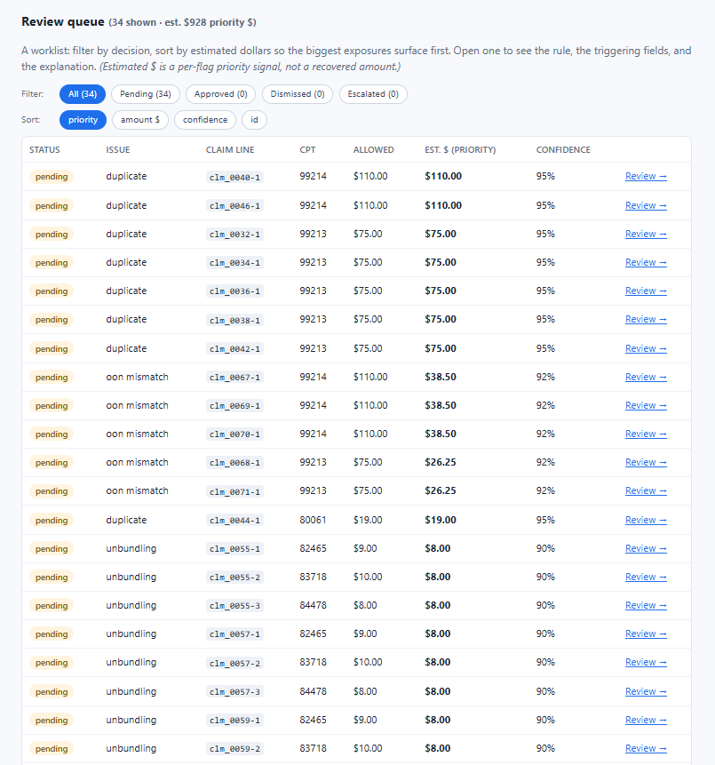

# Payment-Integrity Claims Reviewer

> © 2026 Trevor J. Romack — **source-available for review, not open-source** ([LICENSE](LICENSE)). No reuse or
> commercial use without permission. · tjromack@gmail.com

A claims-review workflow that **detects** likely payment-integrity issues on synthetic claims
with **transparent rules**, **explains** each flag in plain English with an LLM, and routes them
through a **human approval queue** — with a running tally of estimated dollars identified.

> Built in the payment-integrity problem space using **synthetic claims only — no PHI, no
> internal systems**. This is a personal portfolio prototype. The savings figure is an explicit
> *estimate* with stated assumptions, not a financial claim.

**Demonstrates:** transparent rules detect, an LLM only explains, a human decides — with the detector scored on a
**separately-written holdout** and its misses listed.

---

## The problem it solves

Payment integrity and post-payment data mining hinge on finding the small share of claims worth
a closer look — duplicates, unbundling, out-of-network mismatches — without drowning reviewers
in false positives or making opaque automated calls on people's claims. The hard parts are
*explaining* why a claim was flagged (so a reviewer can trust and act on it) and *measuring*
whether the flagging is any good.

This tool separates those concerns cleanly: **rules detect, AI explains, a human decides**, and
a dashboard shows the resulting value.



*One flag, top to bottom — the three concerns kept apart: **① Why it was flagged** — rule `DUP-01` and the exact fields
that triggered it (deterministic, no model in the loop). **② Plain-English explanation** — the LLM explains, grounded
strictly in those fields, with the model + prompt version stamped on it. **③ Your decision** — a human approves,
dismisses, or escalates; the model never does.*

## Who it's for

Payment-integrity / claims-review analysts and the leaders who need to see throughput and impact.

## What it does

- **Ingests synthetic claims** and flags candidate issues — duplicates, unbundling patterns,
  out-of-network mismatches — each with a confidence score and the **rule and fields that
  triggered it**.
- **Explains every flag in plain English** with an LLM, grounded strictly in the triggering
  rule and claim fields (it explains; it does not decide).
- **Human-in-the-loop queue:** reviewers approve, dismiss, or escalate; every decision is stored
  as labeled data for future improvement.
- **Dashboard:** flagged volume, reviewer outcomes (approved / dismissed / escalated), and
  **estimated dollars identified** (clearly labeled as an estimate).



*The review queue — each flag with its issue type, rule confidence, and an estimated-$ priority (a per-flag signal,
**not** a recovered amount), filterable by decision and sorted so the biggest exposures surface first.*

## Why this design

It brings together automation, decision support, a human-in-the-loop experience, cost-savings
tracking, and responsible AI in a payment-integrity workflow. The defining design choice —
keeping *detection* transparent and auditable while using AI only for *explanation* — is the
"where AI should and should not be used" judgment applied to a regulated, high-stakes workflow.

## Tech stack

- **Backend:** FastAPI (Python)
- **Detection:** deterministic rules (+ an optional simple statistical/anomaly score), in Python
- **Explanation:** Anthropic Claude, grounded in the triggering rule + claim fields
- **Storage:** SQLite (file-based; trivial to reset for demos)
- **Frontend:** HTMX + server-rendered templates (queue + dashboard)

See `DECISIONS.md` for why each choice was made, especially why the LLM does not do detection.

## Quickstart

**macOS / Linux:**
```bash
python -m venv .venv && source .venv/bin/activate
pip install -r requirements.txt

make seed && make detect   # labeled claims + the rules engine (flags, confidence, triggers)
make run                   # → http://localhost:8000
make eval                  # detector P/R/F1 + explanation faithfulness on the demo seed (EVAL.md)
make holdout               # detector P/R/F1 on a separately-written holdout
make reset                 # wipe + re-seed + re-detect for a clean demo
```

**Windows (PowerShell):** no `make`, and PowerShell has no `&&` — call the modules directly (each `make` target is
just one of these):
```powershell
python -m venv .venv
.venv\Scripts\python -m pip install -r requirements.txt

.venv\Scripts\python -m app.seed
.venv\Scripts\python -m app.detect
.venv\Scripts\python -m uvicorn app.main:app --port 8000   # → http://localhost:8000
.venv\Scripts\python -m app.eval        # detector P/R/F1 + faithfulness (EVAL.md)
.venv\Scripts\python -m app.holdout     # separately-written holdout
```

Set `ANTHROPIC_API_KEY` in `.env` for the explanation layer. Detection — and the whole served app — runs with no
external calls.

**Hosted / one-command container:** `docker build -t pir . && docker run -p 8000:8000 pir` serves the reviewer queue
and dashboard. Detection runs offline and explanations are cached in the DB, so the running app makes no model call per
request — see [`DEPLOY.md`](DEPLOY.md) (Render steps + the caching design).

## Evaluation

Because the data is synthetic, it carries **ground-truth labels**, so detection quality is measurable
(`make eval` / `make holdout`, full write-up in `EVAL.md`):

- **On the demo seed: 1.00 P/R/F1.** But the seed was written alongside the rules, so a perfect score proves the rules
  *behave as designed*, not that they catch what a payer needs caught.
- **On a separately-written holdout: precision 0.85, recall 0.47, F1 0.61.** The rules nail the textbook cases
  (exact-date duplicates, full-panel unbundling, OON — all 100%) but miss real-world variants: **modifier-59 abuse**,
  **date-drift duplicates**, and **partial / cross-date unbundling** — the two most-cited real evasion tactics. Every
  miss is listed in `EVAL.md`.
- **Explanation faithfulness: 0.97 (33/34)**, LLM-judged, with the one flagged case shown to be a judge error — because
  the check is deterministic-grounding-first and the judge is spot-checked, not trusted blindly.

## Responsible AI & data

- **Synthetic claims only**, with authored ground-truth labels. No real claims or PHI.
- **Detection is transparent.** Rules (and any statistical score) are inspectable; the reason a
  claim was flagged is always a concrete, auditable trigger — never an opaque model verdict.
- **AI explains, it does not decide.** The LLM turns a triggered rule into a readable rationale;
  it has no authority to flag or clear a claim.
- **Human decides.** Reviewers make the call; decisions are logged.
- **The dollars figure is an estimate** with assumptions shown on the dashboard.

## Limits — what this does *not* let you claim

- **Synthetic, hand-labeled data.** Results show whether the rules behave as designed, not real-world performance on
  live claims. No PHI, no real fee schedules, no payer policy library.
- **Three narrow rules, with a measured recall gap.** The holdout (0.47 recall) is the measured bound: DUP-01 keys on
  an exact date and trusts distinct-service modifiers, UNB-01 needs the whole panel present, so **modifier-59 abuse,
  date-drift duplicates, and partial/cross-date unbundling are missed** today. The fix direction is scoped as future
  work, not a solved problem.
- **Not an adjudication engine.** It assembles evidence and a cited rationale for a human reviewer; it does not decide,
  price, or pay a claim. No auto-clear, no auto-deny.
- **The savings figure is an estimate**, not validated recovery — assumptions live in `data/roi_assumptions.md`.
- **The LLM only explains.** It has no authority to flag or clear, and its explanations are scored for faithfulness
  (with a judge that has its own error rate, so it is spot-checked).

## Path to production

- **Detection:** expand and version the rule set; add a properly trained, monitored ML model as
  a *secondary* signal with explainability, never as an unaccountable black box; track
  precision/recall drift over time.
- **Workflow:** reviewer roles/permissions, audit trail of every decision, SLA/queue management,
  and a feedback loop that retrains/tunes from reviewer labels.
- **Governance:** HIPAA-aligned handling if real claims are ever used; PII controls; full
  decision auditability; documented ROI methodology validated with finance.
- **Scale/infra:** Postgres, batch detection jobs, and eval gates in CI so a rule change can't
  ship if precision/recall regresses.

## Project structure

```
app/
  main.py          # FastAPI app + routes
  models.py        # SQLite schema (claims, flags, decisions)
  reference.py     # shared reference data (CPT prices, panels, modifiers) — seed + rules read the same tables
  seed.py          # synthetic claims generator WITH ground-truth labels (the demo seed)
  holdout.py       # a SEPARATELY-written generator that probes the rules' blind spots (make holdout)
  detect.py        # transparent rules engine (DUP-01 / UNB-01 / OON-01) — no model calls
  explain.py       # LLM explanation grounded in the triggering rule + fields
  eval.py          # detector P/R/F1 + explanation faithfulness
  dashboard.py     # volume, outcomes, estimated $ identified (with assumptions)
  roi.py           # savings estimate (assumptions in data/roi_assumptions.md)
  templates/       # reviewer queue + flag detail + dashboard
data/
  claims.db                # generated by `app.seed` / `app.detect` (gitignored)
  roi_assumptions.md       # documented assumptions behind the savings estimate
tests/             # rules, boundaries/malformed input, eval, explain, views
docs/              # screenshots (flag-detail.png, review-queue.png)
Dockerfile  Makefile  scripts/start.sh
DECISIONS.md  DEMO.md  EVAL.md  DEPLOY.md  USER_GUIDE.md  TODO.md  CLAUDE.md
```

## Status

All phases complete (scaffold → labeled seed → rules engine → explanation layer → queue +
dashboard → eval → polish). `make reset && make run` gives a full demo on seeded, detected data;
`make eval` prints the metrics. New here? Start with `USER_GUIDE.md`. See `TODO.md` for the
phased plan and `DEMO.md` for the walkthrough.
